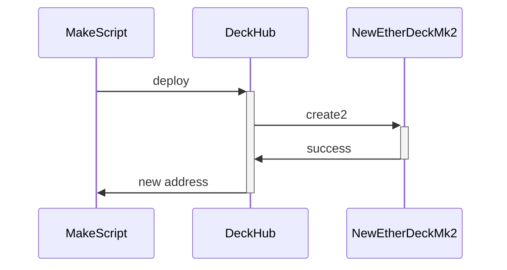
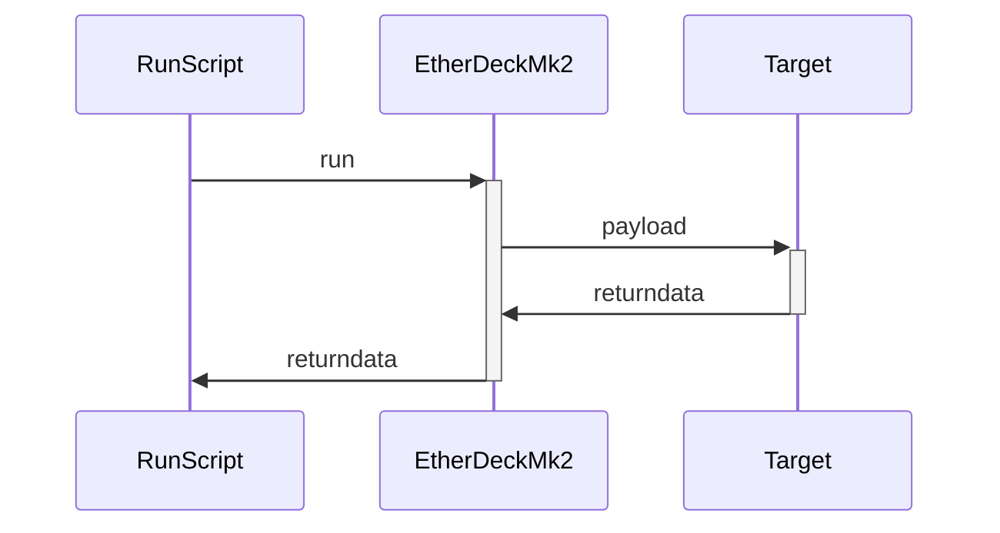
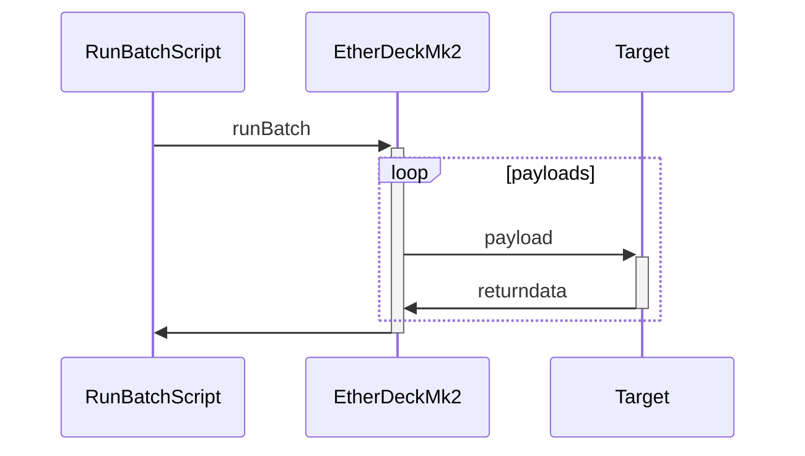
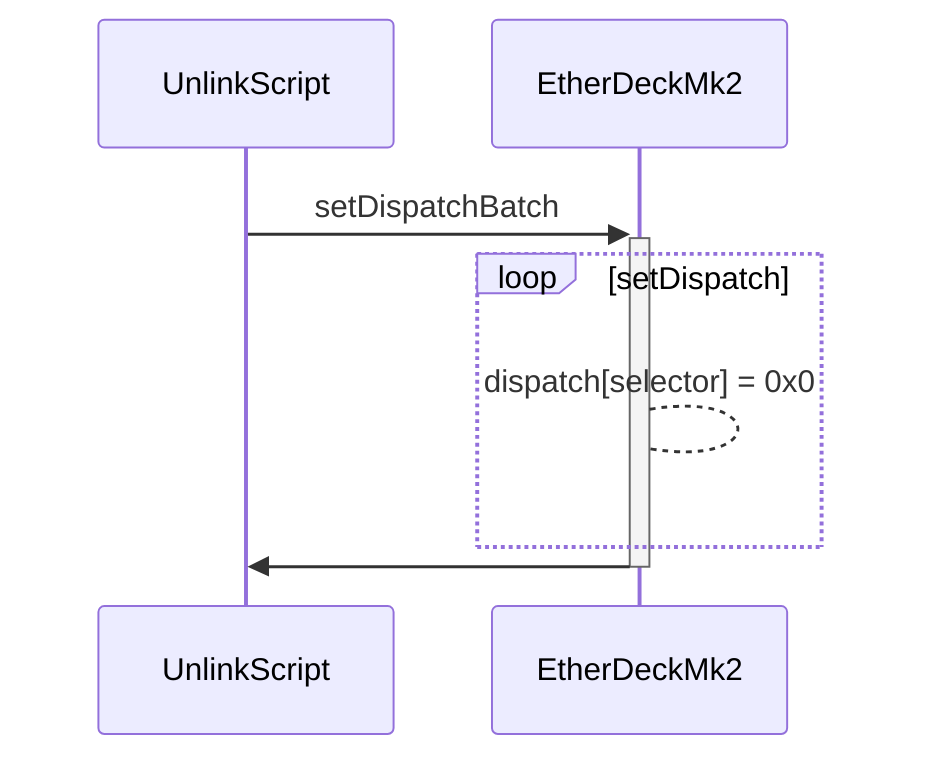
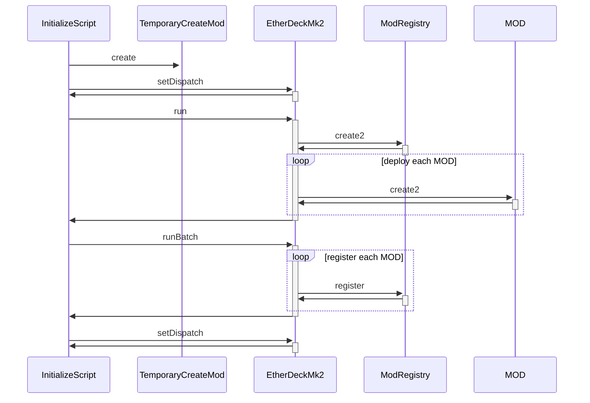

# Deck Tools Mk2

This repository contains helper scripts for the [EtherDeckMk2](https://github.com/jtriley-eth/ether-deck-mk2).

## Scripts

### [MakeScript](script/MakeScript.s.sol)



Usage:

```bash
forge script script/Make.s.sol
```

The invite script creates a new deck for a `runner` from the `DeckHub`.

Overwrites:

- `runner`: overwrite the address to the address you wish to invite.
- `salt`: overwrite the salt for deterministic deployment.

### [LinkScript](script/Link.s.sol)


Usage:

```bash
forge script script/Link.s.sol
```

The link script links mods to the `EtherDeckMk2` in batch. The [`LibMod`](script/util/Mod.sol)
library abstracts over the mod addresses and selectors with a `Mod` enumeration.

Overwrites:

- `mods`: overwrite the mods array to the mods you wish to link.

### [RunScript](script/Run.s.sol)



Usage:

```bash
forge script script/Run.s.sol
```

The run script runs a call from the `EtherDeckMk2`.

Overwrites:

- `target`: overwrite the target address to the target you wish to call.
- `value`: overwrite the value to the call value you wish to use.
- `payload`: overwrite the payload with the calldata you wish to use.

### [RunBatchScript](script/RunBatch.s.sol)



Usage:

```bash
forge script script/RunBatch.s.sol
```

The run script runs a bundle of calls from the `EtherDeckMk2`.

Overwrites:

- `targets`: overwrite the targets array to the target array you wish to call.
- `values`: overwrite the value array to the call value array you wish to use.
- `payloads`: overwrite the payload array with the calldata array you wish to use.

### [Unlink](script/Unlink.s.sol)



Usage:

```bash
forge script script/Unlink.s.sol
```

The unlink script unlinks a mod from the `EtherDeckMk2` in batch. The
[`LibMod`](script/utils/Mod.sol) library abstracts over the mod addresses and selectors with a `Mod`
enumeration.

Overwrites:

- `mods`: overwrite the mods array to the mods you wish to unlink.

## Admin Scripts

### [InitializeScript](script/admin/Initialize.s.sol)



Usage:

```bash
forge script script/admin/InitializeScript.s.sol
```

The initialize script creates the `ModRegistry`, creates and links with a temporary `CreatorMod`,
creates all mods, registers all mods, then unlinks from the temporary `CreatorMod`.
